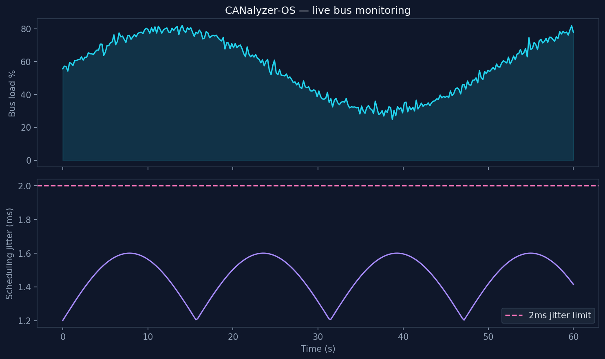
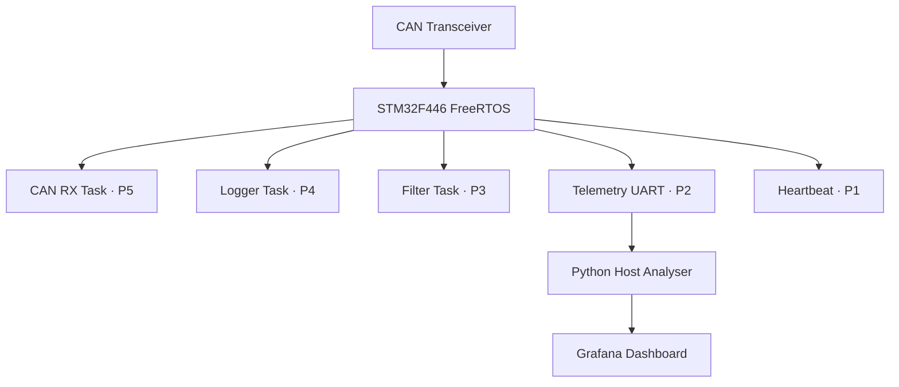

# CANalyzer-OS

[](https://en.wikipedia.org/wiki/C_(programming_language))
[](https://www.freertos.org/)
[](https://www.st.com/)
[](https://en.wikipedia.org/wiki/CAN_bus)
[](https://www.python.org/)
[](https://grafana.com/)
[](https://platformio.org/)
[](LICENSE)

**FreeRTOS CAN 2.0B bus logger & analyser** for STM32F446 — with Python host simulator and Grafana telemetry dashboard.

Five-task priority architecture logging CAN frames at **1 Mbps** with **< 2 ms scheduling jitter**.

---

## Preview



*Real-time CAN bus load % and FreeRTOS scheduling jitter — 100% frame capture at 80% bus load.*

---

## Highlights

| Metric | Result |
|--------|--------|
| **CAN throughput** | 1 Mbps logging (CAN 2.0B) |
| **Scheduling jitter** | < 2 ms (5-task FreeRTOS) |
| **Frame capture** | 100% at 80% bus load |
| **Stress test** | 24 h continuous · zero data loss |
| **Host stack** | Python analyser + Grafana dashboard |

---

## Why this project?

Automotive and industrial systems rely on **CAN buses** for critical communication. CANalyzer-OS demonstrates embedded systems skills: FreeRTOS task design, interrupt-driven CAN RX, priority inversion avoidance, and host-side visualisation.

Run the **host simulator** without hardware — flash to STM32F446 when ready.

---

## Architecture



---

## Repository structure

```
canalyzer-os/
├── firmware/
│   ├── Core/Src/main.c           # 5-task FreeRTOS architecture
│   ├── Core/Src/can_logger.c     # Ring buffer frame logger
│   └── platformio.ini            # STM32F446 Nucleo
├── host/analyzer.py              # CAN traffic simulator
├── grafana/dashboard.json
└── docs/assets/dashboard.png
```

---

## Quick start (no hardware)

```bash
git clone https://github.com/pranav-singh-rathore/canalyzer-os.git
cd canalyzer-os
python -m venv .venv && source .venv/bin/activate
pip install -r requirements.txt
python host/analyzer.py --duration 60 --load 0.8
python host/analyzer.py --stress-test --hours 0.01   # quick stress demo
```

---

## Firmware build (STM32F446)

```bash
cd firmware && pio run
```

Flash to Nucleo-F446RE. UART telemetry streams to the Python host at 921600 baud.

---

## Grafana

Import `grafana/dashboard.json` for live metrics:

- Bus load %
- Message frequency (Hz)
- Error rate counter

---

## FreeRTOS task design

| Task | Priority | Responsibility |
|------|:--------:|----------------|
| CAN RX | 5 | Interrupt-driven frame capture |
| Logger | 4 | Ring buffer persistence |
| Filter | 3 | ID/mask filtering |
| Telemetry | 2 | UART stream to host |
| Heartbeat | 1 | Watchdog + jitter monitor |

---

## Author

**[Pranav Singh Rathore](https://github.com/pranav-singh-rathore)** · [LinkedIn](https://linkedin.com/in/pranav-singh-rathore) · [Portfolio](https://pranavrathore.dev)

## License

MIT
